# Jupyter を使ってみたよ

今回はプログラミング初心者から愛用者まで使うべきツールの紹介をします。

## Jupyter Notebookって何？

プログラムと聞くと、何行、何十行とコードを書いて、初めて動作確認をするイメージを持つ方もいるかと思います。

特に、CやC++など作ったプログラムを実行する前にコンパイルという作業が必要な言語に慣れ親しんでいる人ほど、そういうイメージを持っているのではないでしょうか
(Jupyterを知る前のわたしも同じでした。)

だけど、ご存知の通り、一気に複数行に渡るコードを追加しても想定どおりに動いてくれないことが多々あります。

逆に一発で想定通りに動いてくれたときもとてつもない不安に襲われていると思います。

[Jupyter](https://jupyter.org/)はそういう手間を省いてくれるツールになります。

Jupyterはブラウザ上で様々な言語を対話形式で動かすことができる開発環境です。

本家Wikiの言葉を借りると

>Project Jupyter is a set of open source software projects that form the building blocks for interactive and exploratory computing that is reproducible and multi-language.
>The main application offered by Jupyter is the Jupyter Notebook, a web-based interactive computing platform that allows users to author documents that combine live code,
>equations, narrative text, interactive dashboard and other rich media. ...

>Jupyterは多数に渡る言語をブロックで組み合わせることで対話的にそして探索的に計算処理をすることができるOpen Sourceソフトウェアプロジェクトの集合体です。
>Jupyterの主な機能はJupyter Notebookと呼ばれるブラウザ上で対話的に計算処理を行うことができる環境で、ユーザにその場で実行可能なコード、数式、処理の流れなどの情報を含んだドキュメントを作成することができます。

ここでいう対話的というのは、一行実行したら、すぐに結果が出力されることをいいます。

つまり、Jupyterを使うことで得られる大きなメリットは,

* 位置行ごとに実行確認をすることができる

* 自分が書いたコードの意図を数式や図を使って簡単にまとめることができる

ことにあります。

もちろんその他にもいろいろなOpen Sourceを使うことなどのメリットもあります。

と、言葉で説明しましたが、おそらくイメージできていない方が多いかと思いますので、実際に使っている様子を交えながら説明したいと思います。

## 何はともあれ、使ってみたよ
僕のjupyter notebook のレポジトリは[こちら](https://github.com/RYO0115/python_tester)になります。

今回はここでの処理結果を一例として示しますが、特にクローンする必要はありません。

また、細かい操作やコマンド, インストール方法についてはこの章では省略して、どういうふうに使っていて便利なのかだけ紹介したいと思います。

まずJupyter Notebookを起動するとデフォルトに設定しているブラウザにこちらのようなページが表示されます。

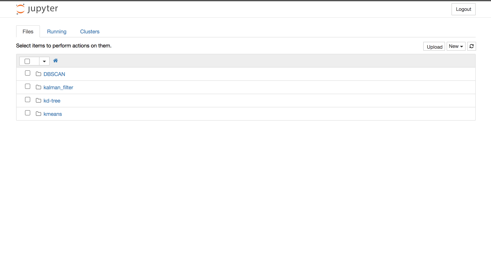

ここではひとまず、既存のNotebookがどういうふうに書かれているかだけ紹介します。

一番上のkalman_filterというディレクトリをクリックすると、下のように.ipynb形式のファイルが入っているのでこれをクリックします。

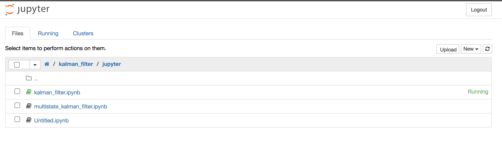

中身はこのような形になっています。

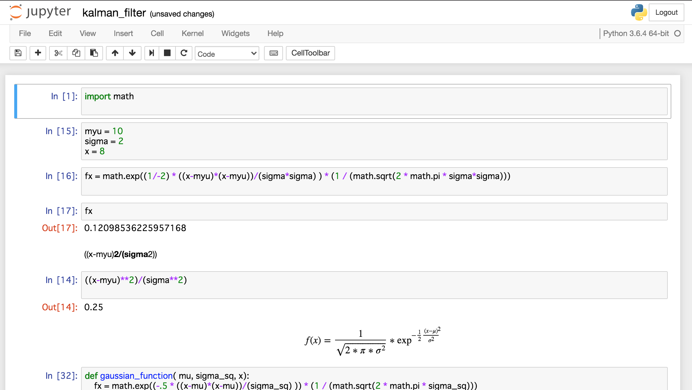

文法はPythonそのものです。
ただここで通常のPythonコードと違うのは、最初に上げたメリット通り、

* 各ブロックごとに計算結果を確認できる
* 各関数に数式などで中身の意図を簡単に説明ができる

ことです。

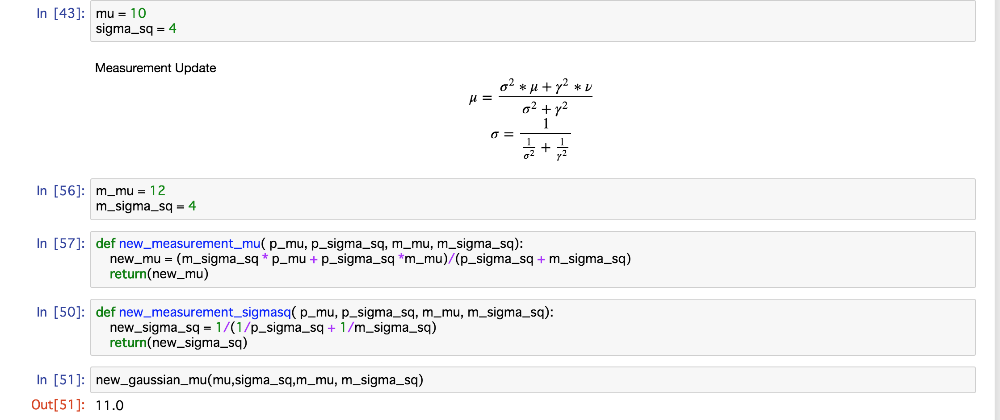

こちらの画像のように、関数を見ただけでは実際にノートなどに書き起こさないと数式全体を把握することが難しいものも
数式を挿入できるため簡単に表現することができます。

(ちなみに数式やコメントはこのブログを書く際に使っているMarkDownという記法で書くことができます。)

その他にも、Pythonという言語が人気な理由の一つに簡単にグラフを書くことができるという点があると思います。

Jupyter Notebookではこのグラフについても、各ブロックごとに結果を確認し、しかもそれをNotebookに表示したまま保存することができます。

これはDBSCANと呼ばれるデータのクラスタリング手法(似たような点同士にグループ分けする手法)を試したNotebookの一例です。

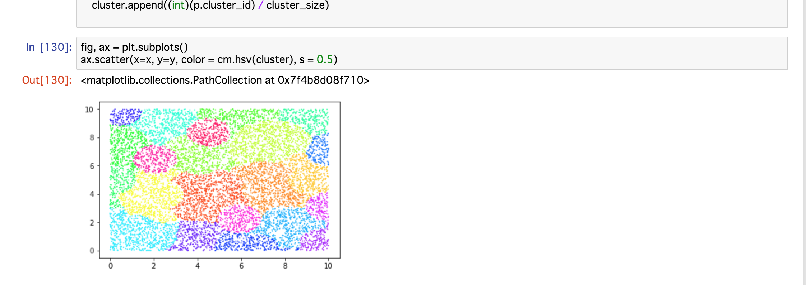

そのため、Jupyter Notebookを使えば簡単なデータ解析の解析結果レポートを作成することもできるわけです。

こういった理由からJupyterは今世界中の開発者がこぞって使っています。

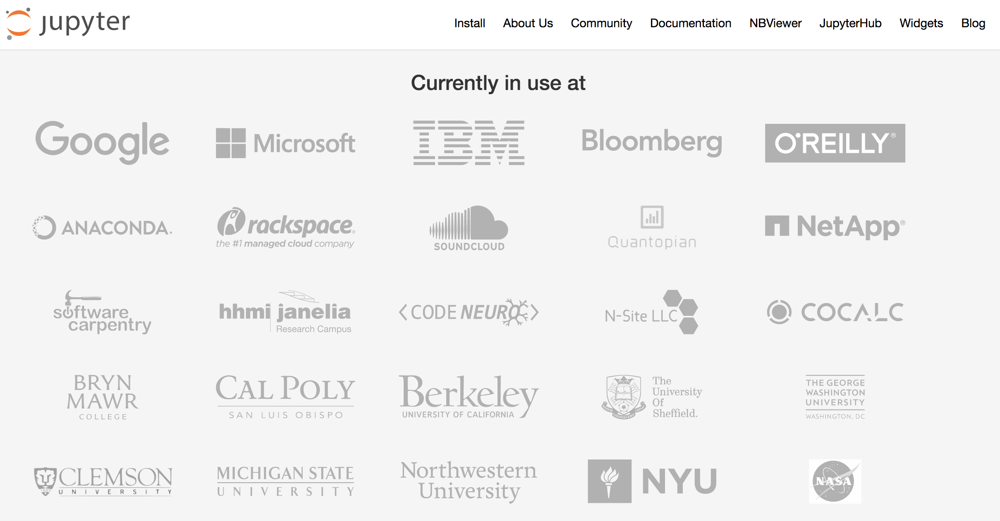

すでにプログラミングをしている人からこれから始める人まで、これまでよりも効率的にプログラムを構築できる環境、それがJupyterなわけです。

## どうやって使うの？
JupyterはOpen Sourceなので何もライセンス等を購入する必要はありません。

ただ、
[公式ページ](https://jupyter.org/install)
に従って一つコマンドを打つだけでインストールすることができます。

ただ、それでもプログラムにあまり触れたことのない方にはハードルが高く感じられる方もいるかもしれませんので、順番に説明していきます。

--------------
**注意**

先に注意書きとして、Pythonがすでに手元のパソコンにインストールされているものとして説明していきます。
もしPythonをインストールされていないようでしたら、
[こちらのサイト](https://techacademy.jp/magazine/15571#sec3)や
[こちら](https://www.python.jp/install/windows/install_py3.html)
を見ていただければ、マウスでクリックするだけでインストールできるので、簡単にPythonユーザになれると思います。

今、巷にはPython2とPython3が存在しています。この２つは同じPythonながら記法が微妙に違ったりしますが、

今からインストールするのであればPython3一択だと思います。

理由はPython2はサポートがもうすぐ終了すること、最新のライブラリは基本Python3を対象にしているからです。

--------------

### インストール方法

ではここからはPythonの環境が出来上がったものとして説明していきます。

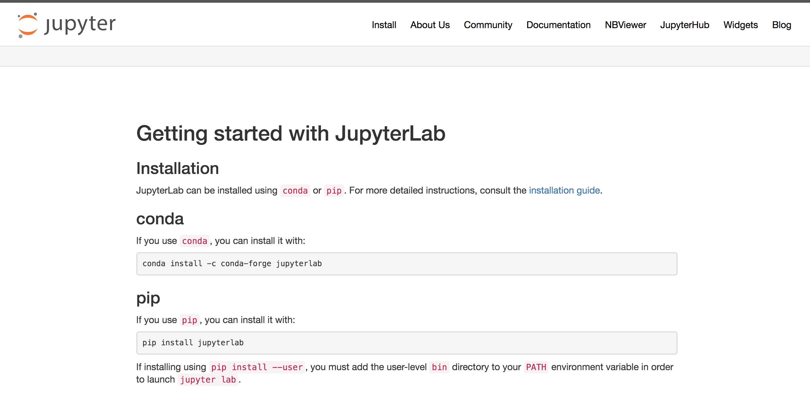

ここではインストール方法として二種類説明されています。

1. Conda(Anaconda)を使う場合
2. pipを使う場合

もしPythonに初めて触るという方の場合は、**2. pipを使う場合**のインストール方法を個人的におすすめします。

Anacondaはnative環境に手を加えずに済むので、パソコンの中の環境をクリーンに保つことができるので個人的におすすめですが、

そのあたりがよくわからない方にはただ、ハードルを上げてしまうだけなので、素直にpipを使えばいいと思います。

またJupyterについてはおそらく、pythonのバージョンが変わっても使い続けると思いますので、そういう意味でも何も気にせず**pip**でインストールしてください。

では、インストール方法を決めたら、Macならターミナル、Windowsならコマンドプロンプト(Mingwでも大丈夫です)を開きます。

pipコマンドはディレクトリはどこでも問題ないので、起動後、下のコマンドを今開いたターミナル、コマンドプロンプトにコピペします。

    pip install notebook

もしインストール時に**権限がありません**などのエラーがでてインストールできなかった場合は以下の方法を試してください。

* Windowsの方:

    左下のwindowsマークを右クリックします。するとメニューが出てくると思うので、その中から**コマンドプロンプトを管理者権限で実行する**という項目があるのでそれをクリックしてください。

    許可を求めるポップアップがでたら臆せずはいをおして、再度上のコマンドを打ち直してください。

* Macの方:

    Macだと**sudo**コマンドが使えます。なので、頭にsudoを加えて打ち込んでみてください。

        sudo pip install notebook

    その後、パソコンにログインする際のパスワードを打ち込めばインストールが開始するはずです。

これでJupyterのインストールは完了です。

### 使い方

#### 1. ディレクトリ(フォルダ)への移動
Jupyter Notebookを使うには、まずターミナルかコマンドプロンプトを起動します。(以降、面倒なのでターミナルと言います。)

次にターミナルでJupyter Notebookを開きたいディレクトリに移動します。

例えば以下のようなディレクトリ(フォルダ)にNotebookを開きたい、保存したいということだったら、

----------

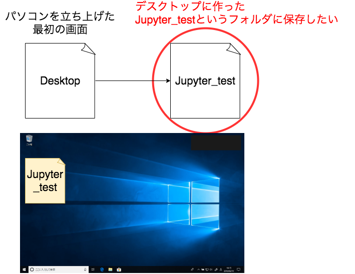

----------

Windowsであれば

    cd デスクトップ
    cd Jupyter_test

で,

Macであれば、

    cd Desktop
    cd Jupyter_test

で移動できます。

余談ですが、もうディレクトリができているので、２つのコマンドをまとめても大丈夫です。

    cd Desktop/Jupyter_test

また、今回Desktop上にディレクトリを作ることを例として上げましたが、別に場所に指定はありません。

#### 2. Jupyter Notebookの起動

ディレクトリへの移動ができたら、
[公式ページ](https://jupyter.org/install)
の言う通り、以下のコマンドを打ち込み(コピペし)ます

    jupyter notebook

これでお使いのブラウザにJupyter Notebookが自動的に開かれるはずです。

#### 3. 自分のJupyter Notebookを作る

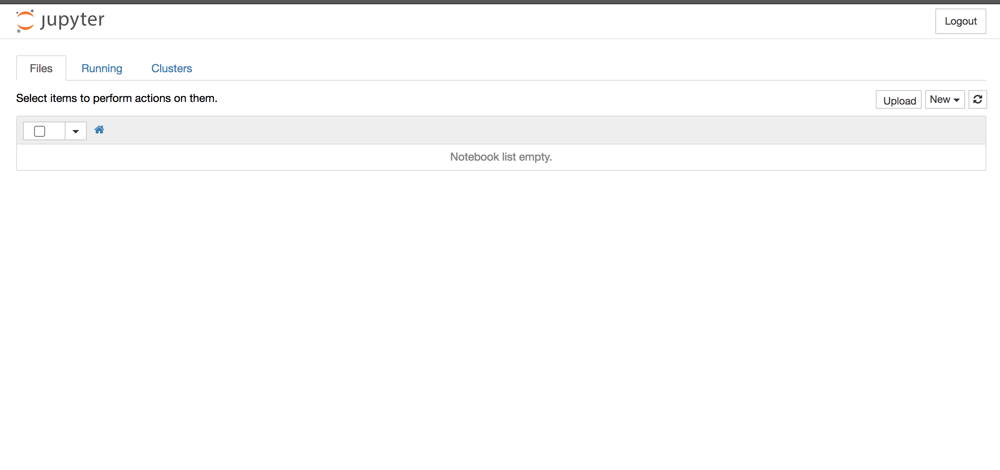

さて、ブラウザに移動すると、おそらく最初は何もnotebookを作っていないので、上の画像のように表示されているはずです。

ではここから、新しくnotebookを作っていきます。

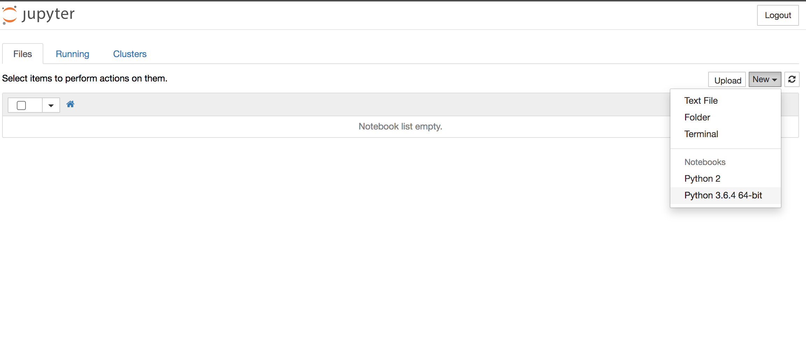

こちらの画像のように右上のNewのボタンをクリックすると新しく作成したいNotebookの種類を選ぶプルダウンが出てきます。

今回はPython3を使いたいので、一番下にあるPython3を選びます。

するとこのような画面に移行して、早速コードを書くことができるようになります。

これでnotebookの作成は完了です。
あとはFileから好きな名前で保存しておきましょう。

#### 4. コードを試しに書いてみる

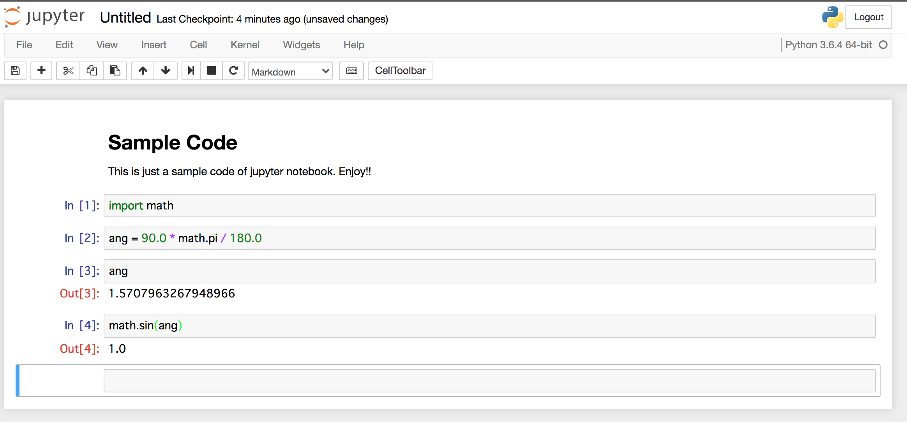

試しにコードを書いてみましょう。
Jupyter Notebookを編集する際にはいくつか覚えることがあります。

1. ブロックを編集する際にはクリックするか、カーソルをあわせてEnter(Return)
2. ブロックを実行したいときは Shift + Enter(Return)
3. Markdown(Code)にしたいときは、ブロックを選択し、メニューのCell -> Cell Type -> Markdownを選択 (ショートカットキーもあります)
4. ブロックを下に追加したいときはブロックを選択してキーボードのBを入力する(Shiftはいりません。Bだけです)　逆に上に入れたいときはAを押します。

基本的にはこれさえ覚えていればあとは使っていくうちに覚えます。

また、ショートカットについてもメニューのHelpから見ることができますので、ぜひそちらも確認してみてください。

## 終わりに

今回はJupyterについて、本当の導入部分を説明しました。

正直、ここからどういうコードを書けばいいのか、わからないという人もいるかと思います。

実は、本当はもっと別のことを書きたかったのですが、そのためにはJupyterの説明をする必要があり、

慌てて作った次第です。

とはいえ、ここで放置するのもあれなので、そんな方向けの簡単なコードを随時追加していきたいと思います。

また、Pythonで書いたものをC,C++に移植して公開もしていきたいと思っているので、またそちらも投稿していきたいと思います。

ではでは。